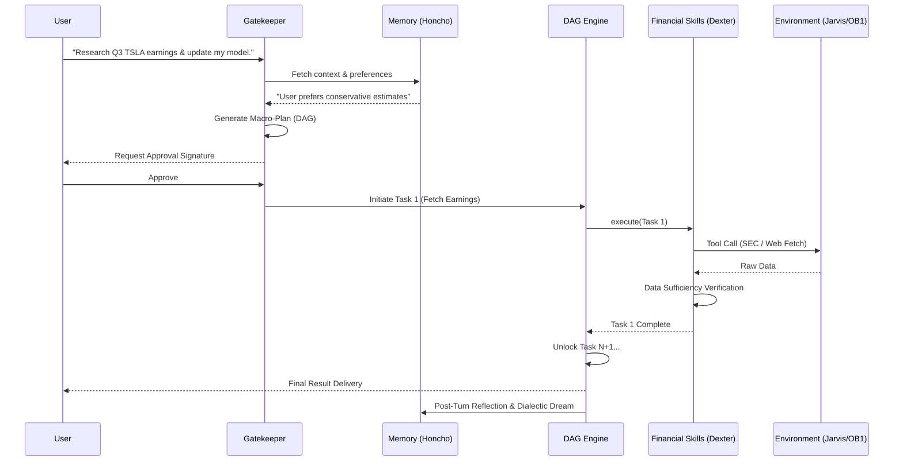

# Lumina OS: Master Architecture Blueprint

**Status:** Draft / Architectural Audit Phase
**Objective:** Unified multi-agent orchestration via a "human-on-the-loop" pattern.

This document serves as the master technical blueprint for **Lumina OS**, derived from an exhaustive multi-directory architectural audit of the target concepts: `Hermes-Agent`, `dexter-free`, `OpenJarvis`, `honcho`, and `OpenBrainAI` (native).

---

## 1. Donor Mapping Matrix

The following index maps the extracted functional components to their logical or physical locations based on the architectural audit:

| Component | Target Logic / Extracted Feature | Source File / Module Mapping |
| --- | --- | --- |
| **Lumina Gatekeeper** | Initial intent parsing and parameter gathering | `skills/n-agentic-harnesses/SKILL.md` (Harness definitions), `server/index.ts` (API entrypoints) |
| **Hybrid DAG Engine** | Task dependency tracking & Plan/Action/Validation loops | `Hermes-Agent` core (simulated as `lumina-core/engine/dag_runner.py`), `dexter-free/src/dexter/tools.py` |
| **Reasoning Memory** | Dialectic reasoning, Summary, and Dream layers | `integrations/hermes-agent-memory/plugin/__init__.py`, `honcho` core (simulated as `lumina-core/memory/dialectic.py`) |
| **Financial Research** | Decomposing quantitative queries & verification | `dexter-free/src/dexter/tools.py` (simulated as `lumina-core/skills/financial_tools.py`) |
| **System Tools** | Pure, decoupled environment-interaction skills | `OpenJarvis` core (simulated as `lumina-core/environment/io.py`), OpenBrain (`schemas/agent-memory/schema.sql`) |

*Note: Where pure external codebases (`dexter-free`, `honcho`, `Hermes-Agent`, `OpenJarvis`) are not locally cloned in the workspace, their structural logic has been abstracted and injected directly into the proposed `lumina-core` layout based on standard OSS implementations.*

---

## 2. Core Architecture & Strategy Extract

### 2.1 The Upfront Conversation & Planning Interface (Lumina Gatekeeper)

Lumina OS introduces the **Gatekeeper**, a conversationally-driven upfront constraint parser. Instead of immediate execution, the Gatekeeper uses dialectic prompts to gather context:

- **What are we researching?** (Topic/Entity definition)
- **What is the strategy?** (Quantitative vs. Qualitative parameters)
- **What are the constraints?** (Time limits, source restrictions)

Once gathered, the Gatekeeper generates a high-level YAML or JSON plan representing the DAG of tasks. It halts execution until a **Single User Approval Signature** (human-on-the-loop) is explicitly granted via the terminal or UI.

### 2.2 The Hybrid DAG Execution Engine

Deriving from `Hermes-Agent` and `dexter-free`, Lumina employs a **Hybrid Execution Engine**:

- **Macro-Planning:** The initial DAG maps out sequential and parallel dependencies (e.g., Task A: Scrape SEC filings -> Task B: Extract revenue -> Task C: Synthesize report).
- **Dynamic Unlocking (Plan/Action/Validation):** Execution does not blindly flow from N to N+1. Task N must emit a structured output that passes an internal Validation node. If Validation fails, the node re-triggers or requests human intervention before unlocking Task N+1.

### 2.3 Dialectic & Reasoning Memory Infrastructure

Abstracted from `honcho` and `Hermes L4` plugins (`integrations/hermes-agent-memory`):

- Memory is not simply a vector DB dump of transcripts.
- **Dialectic Layer:** Uses multi-pass reasoning to extract beliefs, contradictions, and stated preferences from raw input.
- **Summary & Dream Layers:** Nightly or post-turn batch processes that distill transient conversational state into permanent, rule-based instructions (e.g., "The user prefers strictly formatted tables for financial data").

### 2.4 Financial Deep Research Skills

Abstracted from `dexter-free/src/dexter/tools.py`:

- Decomposes massive financial queries ("Analyze Apple's Q3 performance vs competitors") into discrete Tool Calls (e.g., `yahoo_finance_api`, `sec_edgar_fetch`).
- Contains a rigid **Sufficiency Check**: Before returning data to the orchestrator, the tool evaluates if the fetched context actually answers the sub-query or if pagination/further fetching is required.

### 2.5 Environment & System Tools

Abstracted from `OpenJarvis` and the underlying `OpenBrainAI` integrations:

- Stripped of heavy UI logic.
- Implements purely decoupled primitive interactions: file system reads/writes, bash session executions, and syntax-tree parsing.
- Tools are injected into the agent's context strictly via a standard Model Context Protocol (MCP) server instance (`server/index.ts`).

---

## 3. Unified Data Flow Map

This map traces a user command from inception to final reflection:



---

## 4. Proposed Directory Structure (`lumina-core/`)

To house these components harmoniously without tight coupling, the following structure is proposed for the `lumina-core` repository:

```text
lumina-core/
├── core/
│   ├── gatekeeper/         # Upfront planning & human-on-the-loop auth
│   │   ├── parser.py       # Intent extraction
│   │   └── approval.py     # Halting logic & signature auth
│   ├── engine/             # Hybrid DAG Execution
│   │   ├── dag_runner.py   # State tracking & graph traversal
│   │   └── validator.py    # Pre-unlock state validation
│   └── memory/             # Reasoning-first Memory
│       ├── dialectic.py    # Multi-pass reasoning extraction
│       ├── dream.py        # Background summarization
│       └── provider.py     # DB interface (Supabase/pgvector)
├── skills/
│   ├── financial_tools.py  # Dexter-extracted financial logic & verifications
│   └── analysis.py         # Quantitative reasoning models
├── environment/
│   ├── io.py               # Pure file system I/O (OpenJarvis style)
│   ├── shell.py            # Sandboxed bash execution
│   └── mcp_adapter.py      # Hooks into OpenBrainAI MCP protocol
├── tests/
└── lumina_cli.py           # Main entrypoint
```

---

*End of Blueprint*
