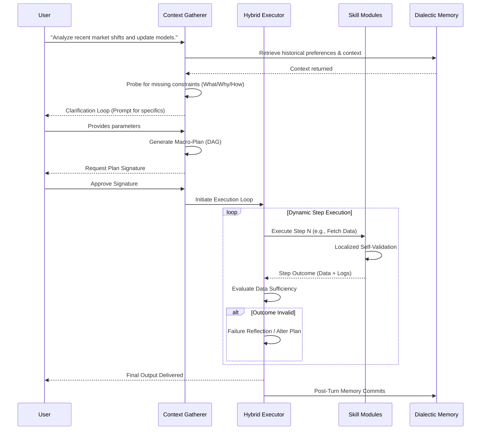

# System Integration Blueprint: Advanced Autonomous Capabilities

**Status:** Draft / Architectural Audit Phase
**Objective:** Integrate advanced multi-agent orchestration, adaptive memory,
and modular runtime frameworks into the core.

This document serves as the master technical blueprint for integrating
advanced autonomous capabilities. It details the current state and proposes a
new modular design.

---

## 1. Current Architecture Trace

The existing codebase, OpenBrain, functions as a persistent memory and AI
gateway using an MCP (Model Context Protocol) server implemented via Deno Edge
Functions and Hono.

- **Entry Points:** The primary entry point is the REST/MCP server
  (`server/index.ts`). Requests are authenticated via API keys and routed to
  specific capabilities (e.g., memory insertion, entity extraction).
- **Task Handling & Pipelines:** Currently, the system relies on direct RPC
  calls to a Supabase/PostgreSQL database (leveraging `pgvector` for semantic
  search and `pgcrypto` for security). Tasks are mostly stateless and
  synchronous.
- **Data Models:** Memory structures are defined heavily in `schemas/` (e.g.,
  `agent-memory`, `enhanced-thoughts`, `typed-reasoning-edges`). The system
  uses `openai/text-embedding-3-small` for vector generation.
- **Rigid vs. Modular:** The database RPCs and core table structures are
  rigid, ensuring data integrity via RLS. However, the MCP adapter pattern
  allows for highly modular client interactions, letting any compliant AI agent
  plug into the unified memory state.

---

## 2. Modular Integration Design

To support advanced orchestration, human-in-the-loop workflows, and dialectic
reasoning, the following directory layout is proposed to be integrated into a
new `lumina-core` (or equivalent orchestration module):

```text
orchestrator/
├── core/
│   ├── parser/                 # Intent extraction & Context-Gathering
│   ├── approval/               # Human-on-the-Loop halting logic
│   └── hybrid_engine/          # Hybrid Task Execution
│       ├── macro_planner.py    # Upfront DAG generation
│       └── dynamic_eval.py     # State validation & step-unlock logic
├── memory/
│   ├── core_retrieval.py       # Basic semantic vector search
│   ├── dialectic_engine.py     # Multi-pass reasoning extraction
│   └── nightly_reflection.py   # Dream layer: Distilling transient states
├── skills/                     # Decoupled Autonomous Skill Interfaces
│   ├── abstract_skill.py       # Standardized wrapper for dynamic registration
│   ├── shell_access.py         # Sandboxed environment operations
│   └── data_research.py        # Deep quantitative & qualitative research tools
└── tests/
```

This design separates the underlying unified memory database (the existing
OpenBrain architecture) from the complex, multi-step orchestration and
reasoning loops.

---

## 3. The Core Loop Specification

The following execution flow traces a complex user command through the newly
proposed orchestration layers:


